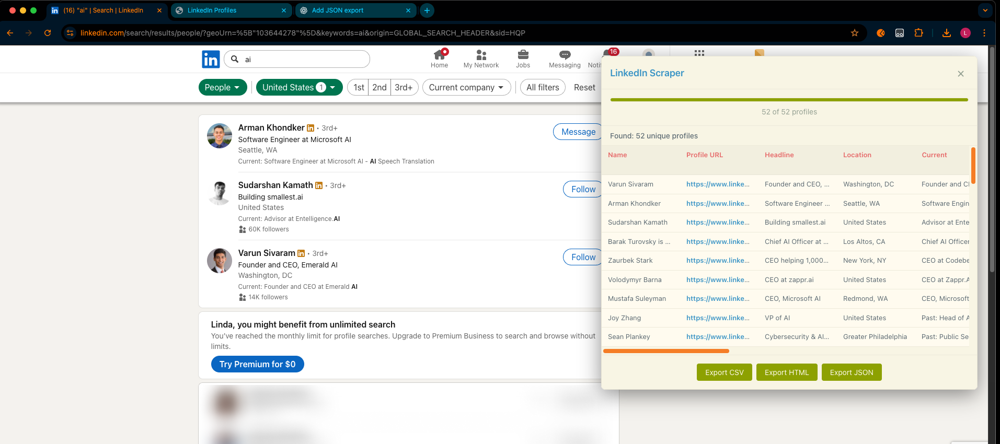
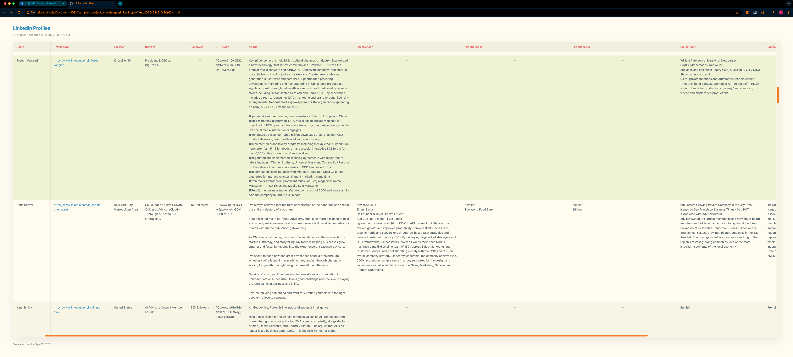
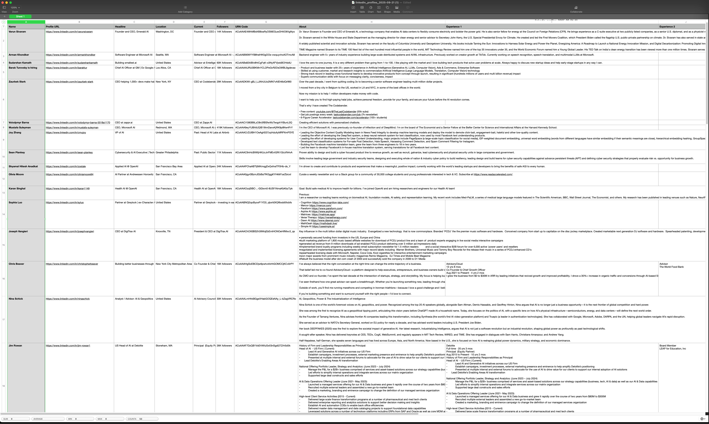
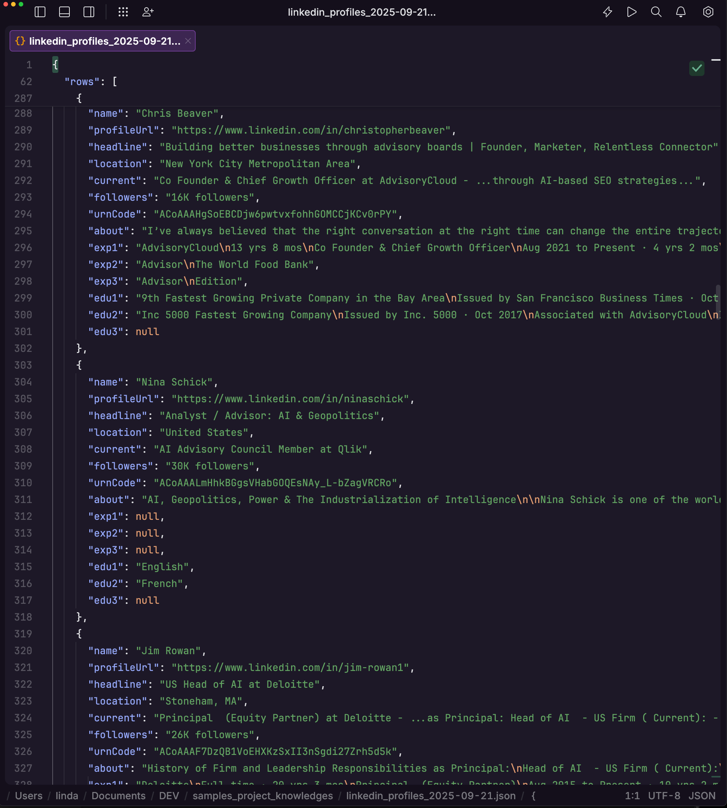

# LinkedIn Profile Scraper (Extended)

A browser-based LinkedIn profile scraper that enriches people search results with profile details and multiple export formats. Designed to run **directly from your DevTools Console**—no extensions required.

> ⚠️ **Heads-up:** LinkedIn frequently adjusts their UI and Voyager endpoints. Behaviour can break without warning. If something stops working, pull the latest build or open an issue.
>
> 📝 **Scope:** Targets **search results** and enriches profiles where possible (About, Experience, Education, Skills, Programming Languages, Licenses & Certs, Volunteering, Organizations). 
---

## Features

- 🖥️ **Console-first workflow:** Copy one script, paste into DevTools, and scrape instantly
- 🧠 **Profile enrichment:** Fetches About, top 3 Experience and top 3 Education entries, plus Skills, Programming Languages, Licenses & Certifications, Volunteering, and Organizations when URN data is available
- 📊 **Live overlay UI:** In-page dashboard with progress bar, deduped table, and inline error messages
- 📦 **Multi-format exports:** CSV, HTML, and JSON payloads that mirror the on-screen table
- 🔄 **Resilient fetching:** Handles Voyager rate limits with jittered retries and graceful warnings
- 🔒 **Local-only processing:** Runs entirely in your browser session; no external servers involved

---
## 🎥 Browser Console Method (How to use video)

https://github.com/user-attachments/assets/237e264d-efa4-4928-ad5c-f7ccdb75bed9


## 📸 Screenshots

### In-page Overlay
  
*Floating controller with live progress, table, and export buttons*

### HTML Export Preview
  
*Formatted HTML table mirroring the console overlay*

### CSV Import Example
  
*Spreadsheet-ready output with headers for enrichment fields*

### JSON Package
  
*Structured JSON payload with metadata, columns, and rows*

---

## 🚀 Quick Start (Browser Console)

**Most reliable path. No extensions, no installs.**

1. **Go to a LinkedIn people search page**  
   Example: [https://www.linkedin.com/search/results/people/?keywords=product%20manager](https://www.linkedin.com/search/results/people/?keywords=product%20manager)
2. **Open DevTools → Console**  
   `F12` (Windows) · `⌥⌘I` (macOS) → choose the **Console** tab
3. **Load the script**  
   Open the raw file, select all, copy:
   [https://raw.githubusercontent.com/withLinda/LinkedIn-profile-scraper-extended/main/build/console.js](https://raw.githubusercontent.com/withLinda/LinkedIn-profile-scraper-extended/main/build/console.js)
4. **Paste & run**  
   Paste into the Console, hit **Enter**, then enter a target profile count when prompted
5. **Monitor progress**  
   Watch the overlay update. You can dismiss messages or stop the script from the UI at any time
6. **Export results**  
   When enabled, choose **Export CSV**, **Export HTML**, or **Export JSON** to download your data

> ℹ️ **Tip:** If you forked this repo, adjust the GitHub URL above to match your username/branch. For offline use, open `build/console.js` from your local clone and copy the contents manually.

---

## Building from Source

```bash
# Clone repository & install dependencies (Node.js 18+ recommended)
cd LinkedIn-profile-scraper-extended
npm install  # only needed if you plan to rebuild
npm run build  # outputs compiled assets into /build
```

Build artifacts:

- `build/console.js` — the console-only script (copy/paste into DevTools)
- `build/linkedin-scraper.user.js` — bundled userscript (included for parity, not covered here)
- `build/userscript.js` — shared runtime pieces for advanced setups

---

## Data Model & Exports

### Extracted Fields

Core:  
Name · Profile URL · Headline · Location · Current · Followers · URN Code

Enrichment (when URN is available):  
About  
Experience 1–3 (merged: company • title • duration(s) • description)  
Education 1–3 (merged: institution • degree • grade • description)  
Skills (comma-separated from “Top skills”)  
Programming Languages (e.g., “Python (Professional)”)  
Licenses & Certs (name • issuer • issued on)  
Volunteering (role • organization • duration • description)  
Organizations (name • role/detail • duration)

### Export Formats

- **CSV:** UTF-8 with BOM, spreadsheet friendly headers, merged experience/education cells
- **HTML:** Standalone document, sticky headers, responsive layout, links preserved
- **JSON:** Includes metadata (columns, timestamp, count) plus row objects reflecting the table

---

## How It Works

1. **Voyager GraphQL API:** Requests people search batches (10 profiles per call)
2. **Keyword detection:** Reads the active search query from the page when possible
3. **Rate-limit strategy:** Jittered 400–1100ms delays, retries + cooldown on `RATE_LIMIT`
4. **Data enrichment:** Resolves profile URNs to fetch About/Experience/Education and additional sections (Skills, Programming Languages, Licenses & Certs, Volunteering, Organizations) when present
5. **Deduplication:** Normalises profile URLs before adding to the dataset
6. **UI overlay:** Injects a themed controller with progress, table, and export buttons

---

## Troubleshooting

**“Not on LinkedIn search page”**  
Load a people search URL before running the script.

**“fetchVoyagerJson not available”**  
The page may not have LinkedIn scripts fully loaded yet; reload and try again, or ensure you ran the latest build.

**Rate limit warnings**  
The overlay pauses and retries automatically. If it persists, wait a few minutes before resuming.

**No enrichment columns**  
Profiles without URNs (or private profiles) may not expose enrichment data—headers remain but cells show `-`. Even with a URN, some sections may be empty if not present on the profile (e.g., no Licenses, no Volunteering, no Languages card, no Top skills in About).

---

## Best Practices

1. Validate with **25–50 profiles** before large runs
2. Allow the overlay to finish before navigating to a new tab
3. Export immediately when the run completes—LinkedIn may clear cached results on refresh
4. Use search filters (location, industry, past company) to reduce noise
5. Keep only one scraping tab active at a time to avoid duplicate requests

---

## Technical Details

- Pure JavaScript bundle compiled for browser consoles
- Uses modular resolver to share code between console/userscript builds
- Randomised intervals + retry cap (3 attempts) for Voyager and profile enrichment fetches
- Table rendering shares export formatting helpers to ensure parity across formats

---

## Privacy & Ethics

- Scrapes data visible to your authenticated LinkedIn session only
- No data leaves your browser; files download directly to your machine
- Respect LinkedIn’s Terms of Service and local regulations
- Use responsibly; prolonged automated access may violate platform policies

---

## Limitations

- Requires an active LinkedIn login and people search access
- Restricted to data exposed in search results + accessible profile URNs
- Subject to LinkedIn UI/API changes and anti-automation limits
- Large jobs may slow if promotion cards or limits interrupt the result stream

---

## Browser Compatibility

- ✅ Chrome / Chromium (recommended)
- ✅ Firefox · ✅ Edge
- ⚠️ Safari (UI overlay works, but DevTools console quirks may appear)
- ⚠️ Brave (disable or adjust Shields for LinkedIn)

---

## Support & Contributing

1. Review **Troubleshooting** above for quick fixes
2. Reproduce on the latest `main` build before filing reports
3. Include Console logs and LinkedIn search URL (redacted as needed) when opening issues

Pull requests welcome—focus on stability, enrichment accuracy, or export improvements.

---

## License & Disclaimer

MIT License — provided as-is. You are solely responsible for how you use this tool.

This project is for educational and productivity purposes. The authors assume no liability for account actions or policy violations that may result from use.

---

**Last Updated:** November 2025
**Version:** 3.2.0
