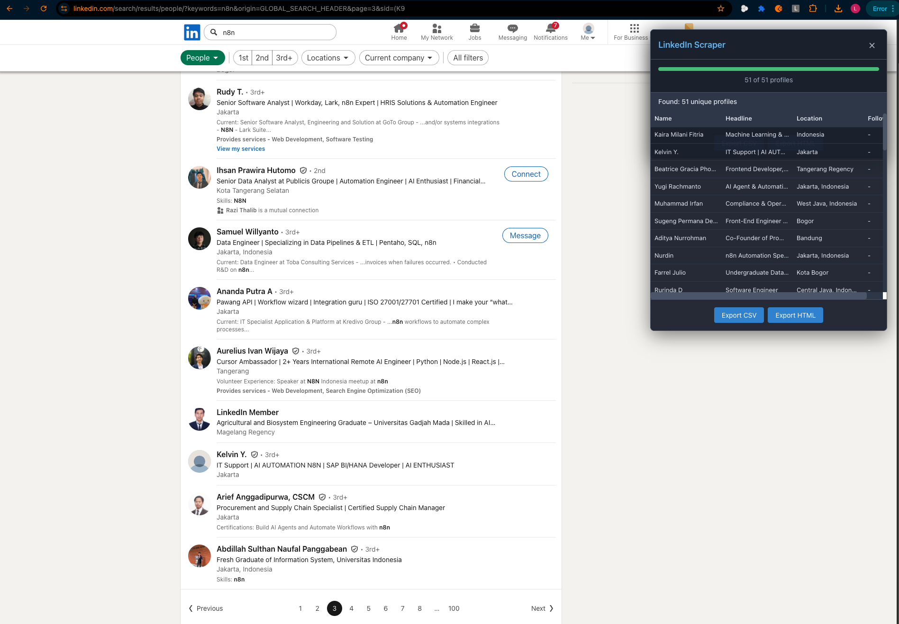
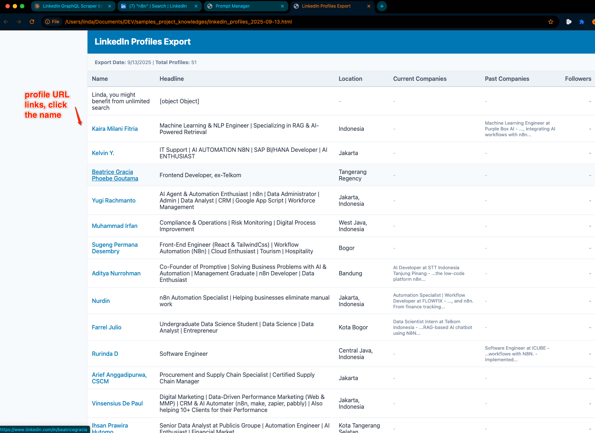

# LinkedIn Profile Scraper

A LinkedIn profile scraper that extracts data from LinkedIn **people search** results using the Voyager API. Works **directly in your browser console** (no extensions) or as a **Tampermonkey userscript** (convenience for frequent use).

> ⚠️ **Important:** LinkedIn changes their UI/endpoints regularly. The scraper may break without notice. If something stops working, check for updates or open an issue/PR.
>
> 📝 **Scope:** Scrapes **search results only** (not full profiles). Contributions for advanced features are welcome!

---

## Features

- 🚀 **Fast & Efficient:** Scrapes hundreds of profiles in minutes  
- 🎯 **Smart Deduplication:** Automatically removes duplicates  
- ⏸️ **Rate Limit Handling:** Retries with jittered delays  
- 📊 **Exports:** CSV and HTML  
- 🎨 **Real-time UI:** On-page overlay with progress & controls  
- 🔒 **No external deps:** Runs entirely in your browser

---

## 📸 Screenshots

### Export Interface
  
*Real-time scraping interface with export options*

### HTML Results
  
*Clean, formatted HTML export with all profile data*

---

## 🚀 Quick Start

### Method 1: Browser Console (Recommended) ✅

**No extensions required.** Most reliable path.

#### How-to Video

Short walkthrough: copy → paste → run in Chrome DevTools Console

https://github.com/user-attachments/assets/be01c9a0-88c6-4ed5-9d62-b3669ef34ea6

#### Steps

1. **Open LinkedIn people search**  
   Go to a people search results page, e.g.:  
   `https://www.linkedin.com/search/results/people/?keywords=software%20engineer`

2. **Open DevTools → Console**  
   Press `F12` or Right-click → **Inspect** → **Console**

3. **Run the scraper**  
   - Open the **raw** console script:  
     `https://raw.githubusercontent.com/withLinda/LinkedIn-profile-scraper-lite/main/build/console.js`  
   - Select all, copy, paste into the Console, press **Enter**

4. **Configure & export**  
   - Enter a target count (e.g., `300`)  
   - Watch progress, then click **Export CSV** or **Export HTML**

---

### Method 2: Tampermonkey (Alternative for frequent use) 🐒

First, install Tampermonkey:  
[Chrome](https://chrome.google.com/webstore/detail/tampermonkey/dhdgffkkebhmkfjojejmpbldmpobfkfo) ·
[Firefox](https://addons.mozilla.org/en-US/firefox/addon/tampermonkey/) ·
[Edge](https://microsoftedge.microsoft.com/addons/detail/tampermonkey/iikmkjmpaadaobahmlepeloendndfphd)

**One-click install**

<a href="https://raw.githubusercontent.com/withLinda/LinkedIn-profile-scraper-lite/main/build/linkedin-scraper.user.js">
  
</a>

If clicking doesn’t open an install dialog, install Tampermonkey first, then click again.  
Prefer a friendly page? See the [Installation Page](https://withlinda.github.io/LinkedIn-profile-scraper-lite/install.html).

**Other install options**
- **Import from URL:** Tampermonkey → *Dashboard* → *Utilities* → *Import from URL* → paste:  
  `https://raw.githubusercontent.com/withLinda/LinkedIn-profile-scraper-lite/main/build/linkedin-scraper.user.js`
- **Manual:** Create a new script → copy the script from:  
  [`build/linkedin-scraper.user.js`](https://github.com/withLinda/LinkedIn-profile-scraper-lite/blob/main/build/linkedin-scraper.user.js) → paste & Save

Once installed, open LinkedIn people search. Use the **🔍 Scrape Profiles** button (top-right) or the Tampermonkey menu.

---

## Building from Source

```bash
# Clone/download this repository, ensure Node.js is installed
cd linkedin-scraper
npm run build   # builds console + userscript into /build
```

Build outputs:

* `build/console.js` — paste into DevTools Console
* `build/linkedin-scraper.user.js` — Tampermonkey userscript

---

## How It Works

1. **Voyager API:** Fetches people search results
2. **Pagination:** \~10 profiles per batch
3. **Rate limiting:** 400–1100ms random delays + up to 3 retries
4. **Deduping:** Based on profile URL
5. **Export:** CSV (Excel/Sheets) and HTML

### Extracted Data

Name · Profile URL · Headline · Location · Current & Past Companies · Followers (if available)

### Export Formats

**CSV:** UTF-8 with BOM; properly escaped
**HTML:** Responsive table with links; print-friendly

---

## Troubleshooting

**“Not on LinkedIn search page”**
Use a people search URL like:
`https://www.linkedin.com/search/results/people/?keywords=...`

**“No CSRF token found”**
Usually safe to ignore; the script continues.

**“Rate limited”**
The script waits and retries. If it persists, pause a few minutes.

**No results**
Broaden your query, confirm you’re logged in, and that search shows results.

---

## Best Practices

1. Start with **10–20 profiles** to validate
2. Don’t run multiple instances simultaneously
3. Large runs (500+) take time—be patient
4. Export immediately after completion
5. Use LinkedIn filters to focus results

---

## Technical Details

* Pure JavaScript (no external libraries)
* Voyager GraphQL endpoints
* 400–1100ms randomized intervals
* \~10 results per page
* 3 retries on rate limiting

---

## Privacy & Ethics

* Scrapes publicly visible information only
* Runs locally in your browser (no data sent to external servers by this tool)
* Requires an active LinkedIn session
* Use responsibly and follow LinkedIn’s Terms of Service

---

## Limitations

* Requires active LinkedIn login
* Limited to search result fields (not full profiles)
* May break when LinkedIn updates UI/APIs
* Rate limiting can slow large jobs

---

## Browser Compatibility

* ✅ Chrome/Chromium (recommended)
* ✅ Firefox · ✅ Edge · ✅ Safari
* ⚠️ Brave (may require Shields adjustments)

---

## Support & Contributing

1. Check **Troubleshooting** above
2. Try both methods (Console vs Tampermonkey)
3. Include errors from DevTools Console when filing issues

Issues & PRs: use the repository’s **Issues** and **Pull Requests** tabs.

---

## License & Disclaimer

MIT License — use at your own discretion.

This tool is for educational purposes. You are responsible for complying with LinkedIn’s Terms of Service and applicable laws. The authors are not responsible for misuse or any consequences of using this tool.

---

**Last Updated:** September 2025
**Version:** 1.0.0
